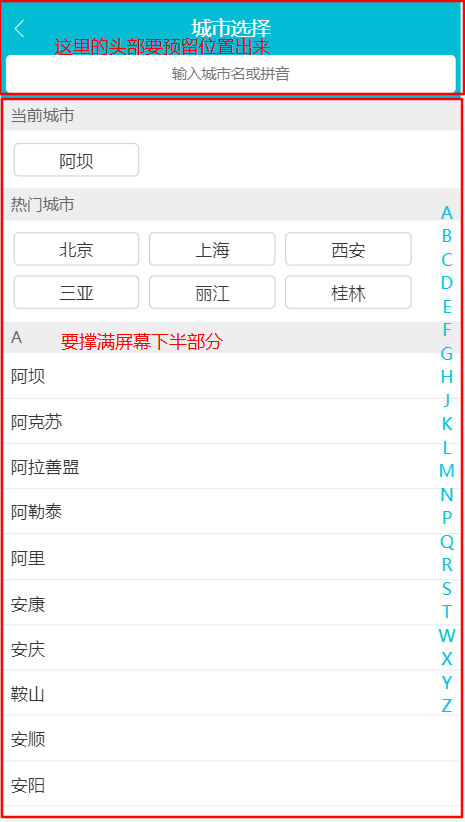

## 知识总结
### 一：通过`webpack`配置的别名来引入`less`文件
通过别名`webpack`配置的`aliase`引入会报错

原因：`css`文件会被用`css-loader`来处理，这里CSS`@import`后的字符串会被`css-loader`视为绝对路径解析，因为我们并没有添加`css-laoder`的`alise`,所以会报找不到`@`目录。

解决方法：
在引用路径的字符串最前面添加`~`符号  
```css
/* webpack将会以~符号作为前缀的路径视作依赖模块而去解析 */
@import '~/style/theme'
```

> 各类非js（`import``require`）直接引用静态资源，依赖相对路径加载问题，都可以用`~`完美解决

### 二：在父组件中改变子组件的样式
**注意：一个子组件的根节点会同时受其父组件的scoped css 和子组件的scoped css的影响**  

在使用到轮播组件`Vue-Awesome-Swiper`时，要改变轮播组件中轮播图片下方的小圆点样式  
  
由于这个样式是在`Vue-Awesome-Swiper`组件中书写的，当我们自己定义的组件的`<style>`标签添加了`scoped`属性时，CSS样式只针对当前组件的元素有效  

解决方法：
```css
/* 改变swiper组件中小圆点样式 */
& /deep/ .swiper-pagination-bullet-active {
  background-color: #fff;
}
```
在这里使用到了深度作用选择器,可以使`scoped`样式中的一个选择器作用的”更深“,可以影响到子组件。

由于`Sass`和`less`之类的预处理器无法正确解析`>>>`,使用`/deep/`操作符来代替`>>>`，作为`>>>`的一个别名来使用。

### 三：`min-width`和`flex`结合使用

### 四：灵活使用定位和`flex`布局

### 五：定位`top=0;bottom=0;`的小技巧
通过定位元素(`absolute,fixed`)的`top`和`bottom`属性，可以很好的实现一些比较复杂的页面布局。这里以城市页面布局为例  

### 疑问记录
1. letter为什么单独建立一个组件之后好用？
2. 粘性定位：`position:sticky`如何使用？
