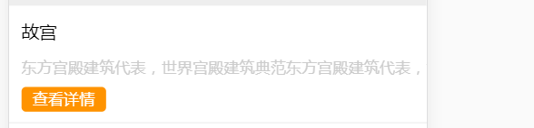
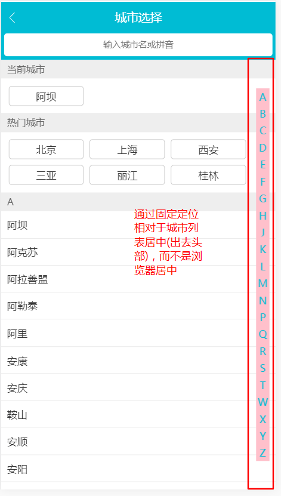

## 知识总结
### 一：通过`webpack`配置的别名来引入`less`文件
通过别名`webpack`配置的`aliase`引入会报错

原因：`css`文件会被用`css-loader`来处理，这里CSS`@import`后的字符串会被`css-loader`视为绝对路径解析，因为我们并没有添加`css-laoder`的`alise`,所以会报找不到`@`目录。

解决方法：
在引用路径的字符串最前面添加`~`符号  
```css
/* webpack将会以~符号作为前缀的路径视作依赖模块而去解析 */
@import '~/style/theme'
```

> 各类非js（`import``require`）直接引用静态资源，依赖相对路径加载问题，都可以用`~`完美解决

### 二：在父组件中改变子组件的样式
**注意：一个子组件的根节点会同时受其父组件的scoped css 和子组件的scoped css的影响**  

在使用到轮播组件`Vue-Awesome-Swiper`时，要改变轮播组件中轮播图片下方的小圆点样式  
  
由于这个样式是在`Vue-Awesome-Swiper`组件中书写的，当我们自己定义的组件的`<style>`标签添加了`scoped`属性时，CSS样式只针对当前组件的元素有效  

解决方法：
```css
/* 改变swiper组件中小圆点样式 */
& /deep/ .swiper-pagination-bullet-active {
  background-color: #fff;
}
```
在这里使用到了深度作用选择器,可以使`scoped`样式中的一个选择器作用的”更深“,可以影响到子组件。

由于`Sass`和`less`之类的预处理器无法正确解析`>>>`,使用`/deep/`操作符来代替`>>>`，作为`>>>`的一个别名来使用。

### 三：`min-width`和`flex`结合使用
  
在详情页面的热销推荐模块，通过`flex`布局实现左侧图片定宽，右侧文字介绍内容自适应。但是当左侧文字内容没有超出时正常显示，超出时会出现如下情况  
  
这里为左侧盒子设置属性：`min-width:0`完美解决。  


### 四：定位`top=0;bottom=0;`的小技巧
通过定位元素(`absolute,fixed`)的`top`和`bottom`属性，可以很好的实现一些比较复杂的页面布局。这里以城市页面布局为例  
  
```css
.city-content {
  position: absolute;
  left: 0;
  top: 2.1067rem;
  bottom: 0;
}
```
上段代码通过`top:2.1067rem`为头部搜索框预留出了位置，通过`bottom:0`将下方剩余区域添充至满，实现头部固定，下方占满手机屏幕的布局。

这里的字母表通过`flex`布局结合`position:fixed`实现相对于城市列表内容垂直居中
```css
.city-letter {
  display: flex;
  align-items: center;
  position: fixed;
  right: 0.2133rem;
  top: 2.1067rem; 
  bottom: 0;
}
```
通过top和bottom将外部盒子占满整个城市列表区域，使用`align-items:center`属性将盒子内的字母`li`垂直居中显示  
  
### 五：城市页面功能实现
#### 1.屏幕滑动到对应字母开头的城市列表，右侧字母表激活
知识点：
* 

实现思路：  
1. 监听城市列表的滚动事件，实时获得滚动时的Y值
2. 将每个字母对应的城市列表的`DOM`高度放入一个数组中，要注意这里的初始位置是当前城市高度+热门城市高度。
3. 将滚动的Y值和高度数组项进行比较，一旦发现数组项中第一个大于Y值得元素时，停止循环，返回对应的索引值

#### 2.在字母表滑动时，城市列表会跳转到滑动到的字母对应的列表
知识点：
* 

实现思路：
1. 
### 六：性能优化
1. 减少`DOM`操作
2. 函数节流

### 七：代码技巧学习

### 知识填坑
1. letter为什么单独建立一个组件之后好用？
2. 粘性定位：`position:sticky`如何使用？
3. 如何判断一个数组是否为空?
